# 森森 Sensen

Un **roguelike tactique** en monde infini, généré procéduralement et totalement continu, en vue isométrique sur grille — combat en **action-time à ticks** structuré par les cinq éléments du **Wu Xing** et sa jauge de chaîne, progression par l'usage à la Elona/Elin, endgame de construction de royaume.

> **L'identité du jeu tient en une phrase :** un jeu de **décisions**, pas de dextérité.

**Moteur : Godot 4.6** · GDScript typé (pas de GDExtension) · PC (Steam), solo et coop 4-8 en host-and-join · aucun asset : tout est dessiné par code.

---

## Sommaire

1. [Jouer](#jouer) — lancer le jeu, les contrôles
2. [En images](#en-images) — captures d'écran
2. [Ce qui tourne aujourd'hui](#ce-qui-tourne-aujourdhui) — les systèmes jouables, par thème
3. [Juger le jeu](#juger-le-jeu) — ce qui attend un œil humain
4. [Structure du dépôt](#structure-du-dépôt)
5. [Développement](#développement) — boucle de validation, outils
6. [Lire le design](#lire-le-design) — le coffre Obsidian

---

## Jouer

Ouvrir `godot/` avec **Godot 4.6** et lancer (F5). Au premier lancement après un clone :
`& $godot --headless --path godot --import` (construit le cache des classes).

La partie démarre par la **création de personnage** (R race, C classe, ↑↓ répartir les points, ←→ année de naissance, Entrée), puis au **camp de base** — une cellule du monde généré, dont on peut sortir à pied.

### Contrôles (tranchés le 2026-08-28)

| Touche | Action |
|---|---|
| **ZQSD** / **clic gauche** | se déplacer · cliquer un ennemi l'attaque avec l'action sélectionnée · cliquer un PNJ ouvre le dialogue |
| **E** | interagir avec ce qui est sous la souris si adjacent, sinon la première chose interactive autour (PNJ, coffre, lit, escalier, parcelle, place de village, eau, bête, plante, mur) |
| **R** | ramasser ce qui est au sol |
| **Clic droit** | **toutes** les options possibles sur la tuile ou l'être visé — c'est le geste à connaître |
| **Tab** | le menu : inventaire, atelier, feuille, capacités, carte, territoire, registre, sauvegarder, charger, minimap, débogage |
| **1 → 0** | la hotbar : armes du râtelier, capacités, bombes, attaque lourde, garde, attendre — la touche sélectionne, la ligne de visée suit la souris, le clic lance |
| **Échap** | fermer un écran / annuler une visée |
| molette, clic milieu | zoomer, déplacer la vue |

Dans les écrans : flèches et Entrée, plus les raccourcis lettres **affichés dans l'en-tête** de chaque écran (aucun raccourci global caché).

---

## En images

Captures prises par `scenes/tests/capture.tscn` (tout est dessiné par code — aucun asset) ; elles sont dans [`captures/`](captures/), prises **en plein écran** (`--plein-ecran`, 1920×1080) et se rafraîchissent avec `capture.tscn -- --plein-ecran --sortie captures/<nom>.png` quand un écran change.

| | |
|---|---|
| 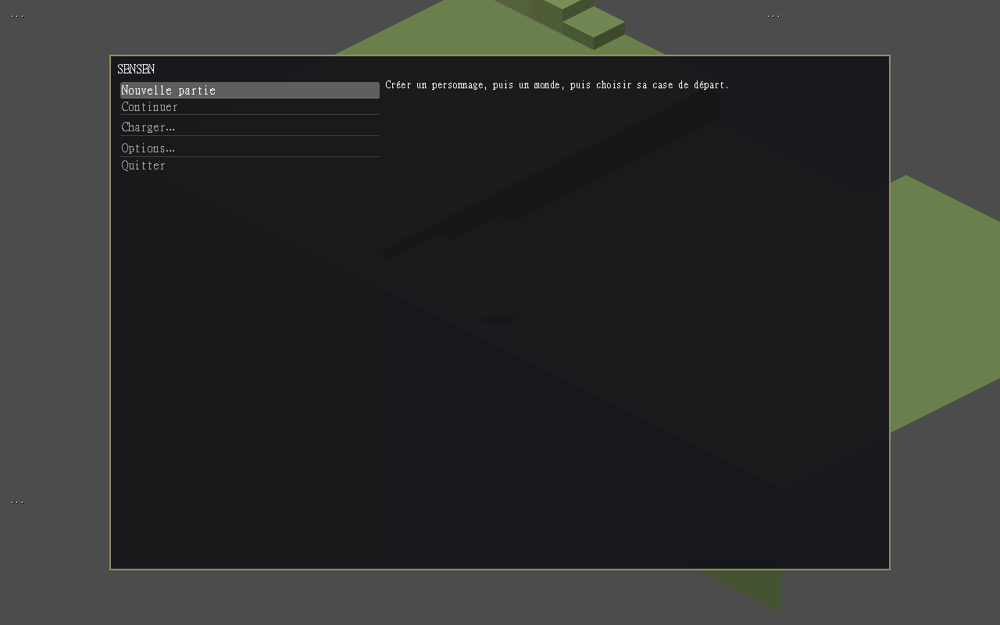 **Écran principal** — nouvelle partie, continuer, charger | 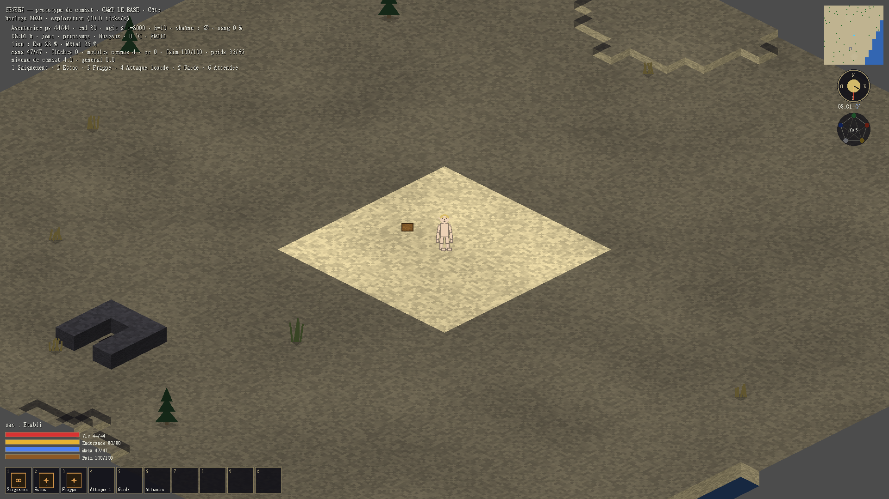 **Le camp de base** — une cellule du monde, HUD (compas, horloge, Wu Xing, barres, hotbar) |
| 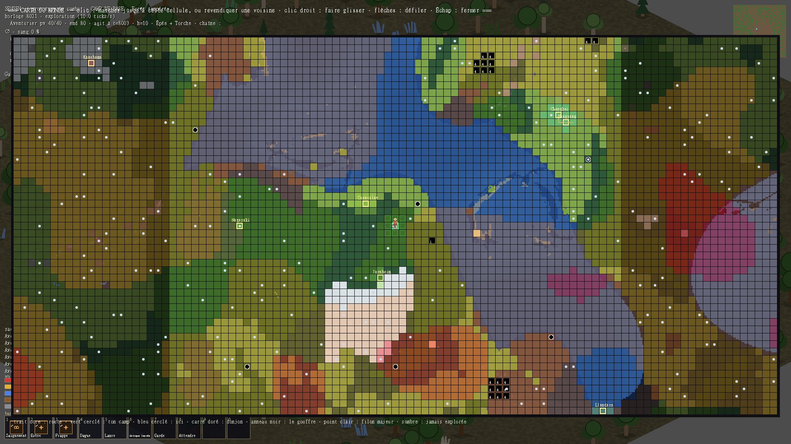 **La carte du monde** — biomes, danger, donjons, filons, voyage rapide | 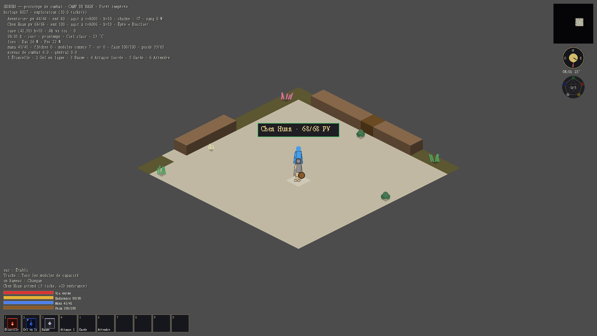 **Un village PNJ** — place, bâtiments, habitants nommés, dialogue au clic |
| 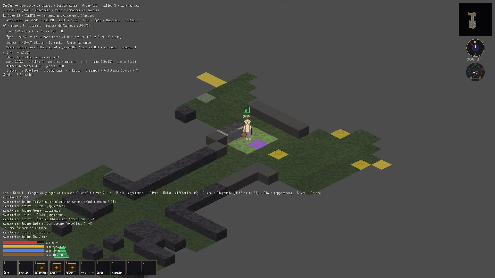 **Un étage de donjon** — blocs pleins, brouillard de guerre, lueur ambiante | 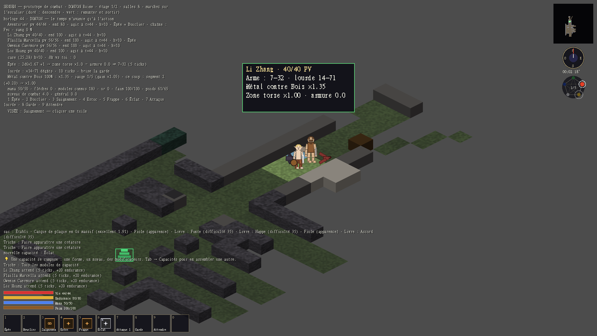 **Le combat** — action-time à ticks, résolution simultanée, ennemis typés |
| 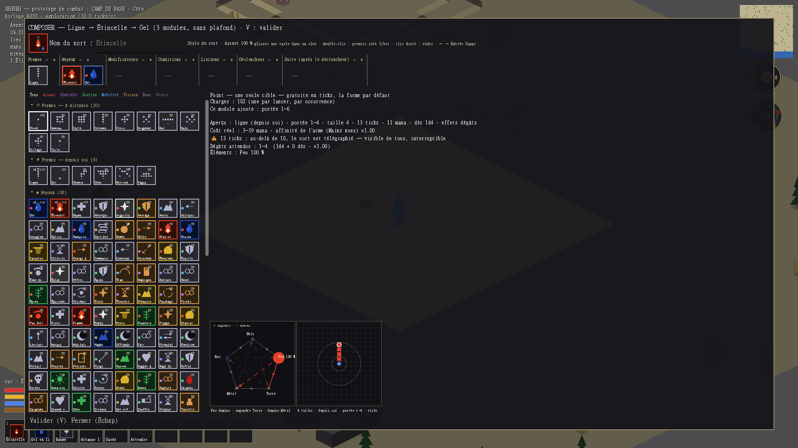 **Le composeur de sorts** — formes, noyaux, modificateurs en glisser-déposer, Wu Xing du sort et aperçu | 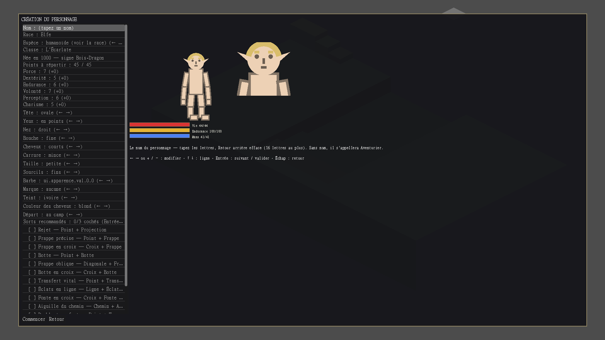 **La création du personnage** — nom, race, **espèce** (toutes les créatures sont jouables), classe, stats, les trois jauges, dix loci d'apparence et treize sorts recommandés à cocher |
| 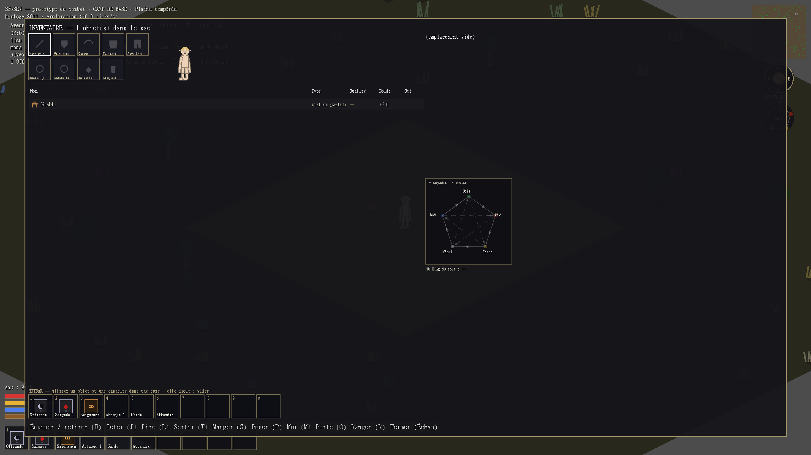 **L'inventaire** — l'avatar et ses cases d'équipement, le sac en liste triable, le Wu Xing de l'objet | 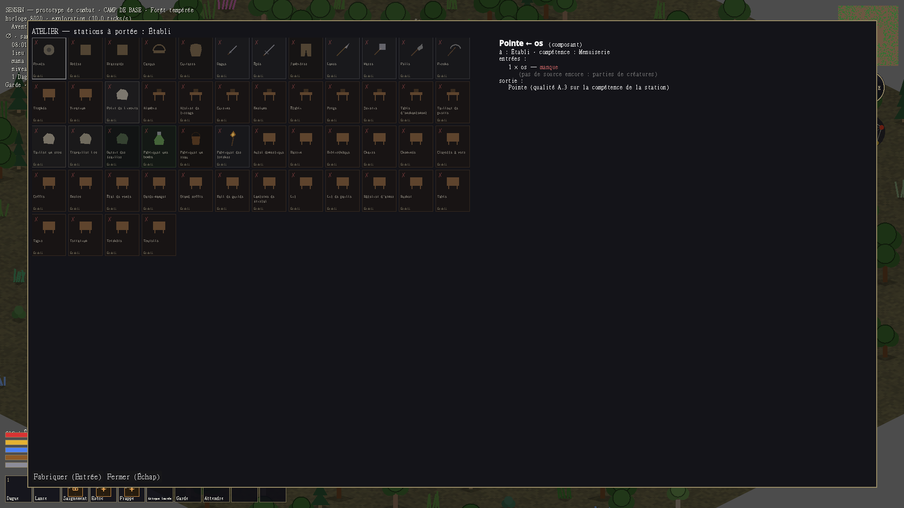 **L'atelier** — les recettes en cartes, l'obtention de chaque composant dépliée |
| 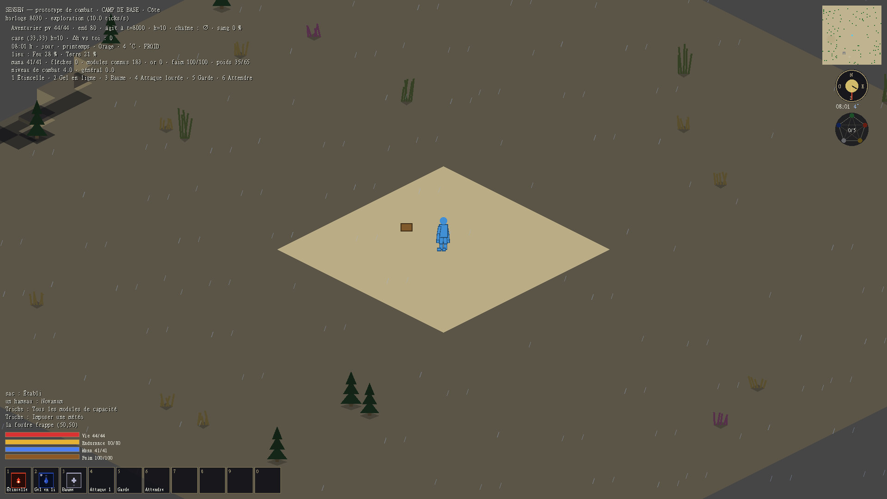 **Un orage sur le camp** — la pluie dessinée par code, la foudre au journal, la météo au HUD | |

---

## Ce qui tourne aujourd'hui

Les étapes 0 à 10 de l'ordre de construction sont codées. Par thème :

**Combat** — action-time à ticks (une horloge par combat, une par être), grille isométrique avec relief, zones de coup par dénivelé, garde en posture, attaque lourde télégraphée, endurance, mana, jauge de chaîne Wu Xing, capacités composées depuis les modules appris (forme + noyau + modificateurs + liaisons), statuts et anti-stunlock, IA utility pilotée par les données.

**Exploration** — donjons de 128×128 (14-24 salles reliées en réseau maillé), brouillard de guerre par ligne de vue et Perception, éclairage (torches, meubles lumineux), creuser et terrasser, filons par profondeur et strates, coffres, monstres rares.

**Monde** — monde infini par cellules de 128×128, huit couches de bruit (altitude, température, humidité, mana, danger, végétation, sismique, ressources), biomes, routes, hameaux et villes, carte du monde et voyage rapide, cycle jour/nuit (24 000 ticks), saisons, **météo** en fonction pure du temps et du lieu.

**Le monde qui bouge** — automate d'eau (une tranchée creusée au bord d'un lac s'inonde, un talus endigue, la pluie remplit les creux, une nappe qui n'est plus alimentée se retire, la canicule assèche), **courant** qui emporte ce qui flotte, gel qui rend la mer marchable, **foudre** d'orage pondérée par la hauteur et la conductivité des matériaux (paratonnerre émergent), **feu de tuile** qui prend, se propage selon la flammabilité, brûle qui s'y tient et s'éteint sous la pluie, **lave** dans les étages profonds qui se fige en obsidienne au contact de l'eau.

**Objets** — loot par profondeur (rareté, affixes, gemmes serties, uniques d'artefact), craft compositionnel (matériaux → composants → objets, les stats se calculent), stations de transformation, alchimie et potions, cuisine, poids porté et surcharge.

**Vivre** — faim et nourriture, sommeil, PNJ nommés avec relations, rumeurs et routines horaires, dialogue, commerce au prix suggéré, quêtes et guildes, compagnons (recrutement, ordres, postures, échange d'équipement, résurrection), apprivoisement, agriculture, élevage à génétique (8 espèces, registre et paliers).

**Territoire** — claims, rôles de cellule, résidents assignés, stocks et trésor, boutique passive, raids hebdomadaires, gouvernances, royaumes PNJ avec lois et douanes, accords diplomatiques, conquête de village.

Ce qui reste ouvert, en détail : **`docs/00 - Index/Vers la production.md`**.

---

## Juger le jeu

Le code peut vérifier qu'une règle s'applique ; il ne peut pas dire si c'est **bon**. Les questions qui attendent un œil humain, rangées dans l'ordre d'une session de jeu :

**`docs/00 - Index/À juger — parcours de jeu.md`**

L'étape 11 (coop) ne commencera pas avant qu'un solo soit jugé bon.

---

## Structure du dépôt

| Chemin | Ce que c'est |
|---|---|
| [`godot/`](godot/) | Le projet Godot — `autoload/`, `data/`, `systems/`, `scenes/`, `locale/` |
| [`godot/data/`](godot/data/) | **Tout le contenu du jeu, en JSON** — un fichier par entrée, rangé en sous-dossiers thématiques ([README](godot/data/README.md)) |
| [`docs/`](docs/) | Le design complet : un **coffre Obsidian** de notes atomiques, reliées et navigables |
| [`tools/`](tools/) | Outillage — `check_vault.py` (intégrité du coffre) et les générateurs de données |
| [`archive/`](archive/) | Le GDD source monolithique (v2.0) — référence historique ; les notes de `docs/` font foi |
| [`AGENT.md`](AGENT.md) | Le prompt de développement autonome — règles de travail, boucle de validation, ordre |

### Dans `godot/`

- `autoload/game_data.gd` charge et **valide** tout `data/` au boot (schémas, erreurs `fichier → champ`, bloquant en debug ; F5 recharge à chaud). Depuis le 2026-08-29, un catalogue peut être **rangé en sous-dossiers** (`data/modules/noyau/`, `data/items/arme/`…) : l'id reste le nom du fichier, le dossier n'est qu'un classement pour l'humain.
- `systems/combat/simulation.gd` est **l'autorité** : une partie solo est une partie hébergée dont la porte est fermée. Le client (`scenes/demo/main.gd`) n'envoie que des **intentions** et n'affiche que ce que la simulation lui dit.
- `scenes/entities/creature.tscn` est la scène **unique** de tout être — le joueur n'est pas un type à part. Rig et équipement visible viennent des données.

---

## Développement

Quatre contraintes permanentes, dès la première ligne de code :

1. **Une partie solo EST une partie multijoueur hébergée** dont la porte est fermée — serveur autoritaire même en solo, intentions côté client, déterminisme par ticks.
2. **Une brique à la fois**, avec un critère de sortie formulé avant de commencer.
3. **`tr()` dès le premier écran** — aucune string affichable en dur, jamais. **Français et anglais sont complets** (1 983 clés chacun) ; japonais et chinois visés au lancement.
4. **Tout le contenu est de la donnée** — JSON validé au boot, hot-reload, zéro valeur de gameplay en dur.

### La boucle de validation

Après chaque incrément, dans cet ordre :

```powershell
$godot = "C:\Users\ciryl\Documents\Godot_v4.6.3-stable_win64.exe"

& $godot --headless --path godot --import                                             # une fois après un clone (cache des classes)
& $godot --headless --path godot res://scenes/tests/test_combat.tscn                  # la suite de tests (~5 min)
& $godot --headless --path godot res://scenes/demo/main.tscn --quit-after 60          # la scène tourne sans erreur
python tools/check_vault.py                                                           # le coffre est intègre
python tools/audit_donnees.py                                                         # les liens entre catalogues tiennent
python tools/i18n_couverture.py                                                       # couverture de traduction (fr et en : 100 %)
```

Aucune sortie ne doit contenir `SCRIPT ERROR`, et la suite doit finir par `TESTS : tout passe`.

### Les autres outils

```powershell
# Chasse aux bugs : des intentions au hasard pendant N pas (aussi : --bete, --ia). Lire les SCRIPT ERROR.
# Le bilan final dit si le joueur a survécu et où il est ; « vivants 1 » juste après un voyage est normal (la faune
# de la cellule d'arrivée n'a pas encore éclos), pas un bug.
& $godot --headless --path godot res://scenes/tests/fuzz.tscn -- --pas 3000 --graine 7

# Rapport des critères mesurables de la spécification du prototype
& $godot --headless --path godot res://scenes/tests/test_criteres.tscn

# Capture d'écran (fenêtré — le `--` avant les options est obligatoire)
& $godot --path godot --disable-vsync res://scenes/tests/capture.tscn -- --arene 3 --heure 12 --frames 8 --sortie user://c.png
#   autres options : --donjon --torche --raid --talents --carte --ecran inventaire|menu|gestion|atelier
#   les PNG sortent dans %APPDATA%\Godot\app_userdata\Sensen\
```

Un seul Godot à la fois (le fuzz dure ~4 min, la suite ~5). Une capture statique ne juge pas la fluidité — il faut le dire à l'humain qui lit.

### Générateurs de données

`audit_donnees.py` vérifie les liens **entre** catalogues, que ni les schémas ni `check_vault.py` ne voient : une famille de matériaux qu'aucune recette ne produit, une dépouille sans objet, un habitat d'élevage sans meuble. `tools/gen_*.py` transcrivent des tableaux des notes en JSON (`gen_materials.py`, `gen_affixes.py`, `gen_status_effects.py`, `gen_creature_actions.py`, `gen_dungeon_prefabs.py`, `gen_name_cultures.py`, `gen_palette.py`, `gen_progression_data.py`, `gen_rigs.py`, `gen_arenas.py`), et `structure_modules.py` ajoute la forme structurée des effets de modules. Ils écrivent dans les sous-dossiers de rangement et **effacent ce qu'ils régénèrent** : ne pas éditer à la main un fichier qu'un générateur possède.

---

## Exécutable (alpha)

Les versions jouables sont dans les [Releases](https://github.com/devmarcpro/sensen/releases) du dépôt (Windows x86_64, `.pck` embarqué — décompresser et lancer `Sensen.exe`). Pour reconstruire :

```
# une fois : les gabarits d'export 4.6.3 dans %APPDATA%\Godot\export_templates\4.6.3.stable\
& $godot --headless --path godot --export-release "Windows Desktop" ../build/Sensen.exe
```

Le préréglage est `godot/export_presets.cfg` (tests exclus, données JSON et locales incluses).

## Lire le design

Ouvrir [`docs/`](docs/) comme coffre dans **Obsidian**. Point d'entrée : `00 - Index/Sensen — Index général.md`.

- **La note fait foi.** Le code applique les notes ; il ne les invente pas. Quand un détail manque, on tranche l'option la plus simple et cohérente et on l'écrit dans la note (callout daté) **avant** de coder.
- Chaque note porte en **alias** les références du GDD (`A.4.6`, `E.3`, `B.13`…) — tous les renvois résolvent.
- Frontmatter filtrable : `statut` (décidé / à-trancher / playtest / contenu-à-produire), `etape` (0-11), `domaine`.
- Les callouts `> [!success] Codé le …` disent ce qui est implémenté et **quelles décisions ont été prises en chemin**.
- `docs/99 - Ouvert/` archive les questions tranchées depuis : chaque note y porte sa décision et sa date.
- `python tools/check_vault.py` vérifie liens morts, frontmatter incomplet et comptages périmés (sortie non nulle si erreur).

### L'ordre de construction

Chaque étape produit quelque chose de **jouable et jugeable**, jamais une brique invisible.

| # | Étape | Ce qu'on obtient | État |
|---|---|---|---|
| 0 | Prototype de combat isolé | *le combat est-il bon ?* | codé |
| 1 | Combat rapatrié + paperdoll minimal | un combat propre dans le vrai projet | codé |
| 2 | Génération de donjon | un espace clos à explorer | codé |
| 3 | Loot (affixes, gemmes, rareté) | une raison de descendre | codé |
| 4 | Progression (usage, potentiel) | une raison de recommencer | codé |
| 5 | ⭐ **Jalon — roguelike de bout en bout** | entrer, combattre, looter, progresser, ressortir | codé |
| 6 | Matériaux + craft compositionnel | fabriquer ce qu'on n'a pas looté | codé |
| 7 | Camp de base | un point d'ancrage entre deux expéditions | codé |
| 8 | Génération du monde | un monde à parcourir entre les donjons | codé |
| 9 | PNJ et villages | un monde habité | codé |
| 10 | Royaumes, lois, économie, claims | l'endgame de territoire | codé |
| 11 | Coop | dernier chantier | **jamais avant un solo jugé bon** |
